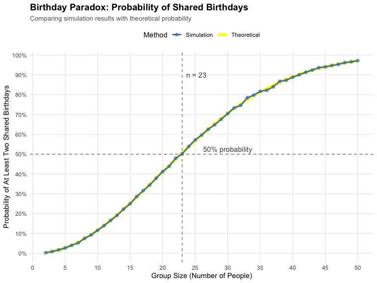

Homework 5
================
Yongyan Liu (yl6107)
Oct 30, 2025

## Problem 1: Birthday Paradox Simulation

### Function to simulate birthdays

Create a function that randomly assigns birthdays to n people and checks
for duplicates:

``` r
birthday_simulation = function(n) {
  # Randomly assign birthdays to n people (1-365)
  birthdays = sample(1:365, size = n, replace = TRUE)

  # Check if there are any duplicate birthdays
  has_duplicate = any(duplicated(birthdays))

  return(has_duplicate)
}
```

### Run simulations

Run the function 10,000 times for each group size from 2 to 50:

``` r
# Number of simulations per group size
n_simulations = 10000

# Group sizes to test
group_sizes = 2:50

# Run simulations and calculate probabilities
simulation_results = tibble(
    group_size = group_sizes
  ) %>%
  mutate(
    # Run 10,000 simulations for each group size
    probability = map_dbl(group_size, function(n) {
      # Run the simulation n_simulations times
      results = replicate(n_simulations, birthday_simulation(n))
      # Calculate probability as proportion of TRUE results
      mean(results)
    }),
    
    # Calculate theoretical probability using the birthday paradox formula
    theoretical_prob = map_dbl(group_size, function(n) {
      if (n > 365) return(1)
      
      # P(at least one match) = 1 - P(no matches)
      prob_no_match = prod((365:(365-n+1))/365)
      1 - prob_no_match
    })
  )
```

### Visualization

Create a plot showing the probability of shared birthdays vs. group
size:

``` r
ggplot(simulation_results, aes(x = group_size)) +
  geom_line(aes(y = theoretical_prob, color = "Theoretical"), linewidth = 2) +
  geom_line(aes(y = probability, color = "Simulation"), linewidth = 1) +
  geom_point(aes(y = probability, color = "Simulation"), size = 2, alpha = 0.6) +
  geom_hline(yintercept = 0.5, linetype = "dashed", color = "gray50", linewidth = 0.5) +
  geom_vline(xintercept = 23, linetype = "dashed", color = "gray50", linewidth = 0.5) +
  annotate("text", x = 30, y = 0.5, label = "50% probability",
           vjust = -0.5, color = "gray30") +
  annotate("text", x = 23, y = 0.9, label = "n = 23",
           hjust = -0.2, color = "gray30") +
  scale_color_manual(
    name = "Method",
    values = c("Simulation" = "steelblue", "Theoretical" = "yellow")
  ) +
  scale_y_continuous(labels = scales::percent_format(),
                     breaks = seq(0, 1, 0.1)) +
  scale_x_continuous(breaks = seq(0, 50, 5)) +
  labs(
    title = "Birthday Paradox: Probability of Shared Birthdays",
    subtitle = "Comparing simulation results with theoretical probability",
    x = "Group Size (Number of People)",
    y = "Probability of At Least Two Shared Birthdays"
  ) +
  theme_minimal() +
  theme(
    plot.title = element_text(face = "bold", size = 14),
    plot.subtitle = element_text(size = 10, color = "gray40"),
    panel.grid.minor = element_blank(),
    legend.position = "top"
  )
```

<!-- -->

### Comments

The birthday paradox demonstrates a counterintuitive probability
phenomenon. Key findings from the simulation:

1.  **Simulation validates theory**: The simulation results (blue line)
    closely match the theoretical probability (yellow line) calculated
    using the formula P(match) = 1 - (365/365) × (364/365) × … ×
    ((365-n+1)/365). This confirms that our simulation is working
    correctly and that 10,000 iterations provide a reliable estimate.

2.  **Rapid probability increase**: The probability of finding at least
    two people with the same birthday increases surprisingly quickly as
    group size grows. With just 23 people, the probability exceeds 50%.

3.  **The “paradox”**: Most people intuitively expect a much larger
    group would be needed to reach 50% probability. Since there are 365
    possible birthdays, one might initially think you’d need 100+ people
    for a 50% chance. However, only 23 people are needed.

4.  **Near certainty with small groups**: By the time we reach 50
    people, the probability is approximately 97.2%.
