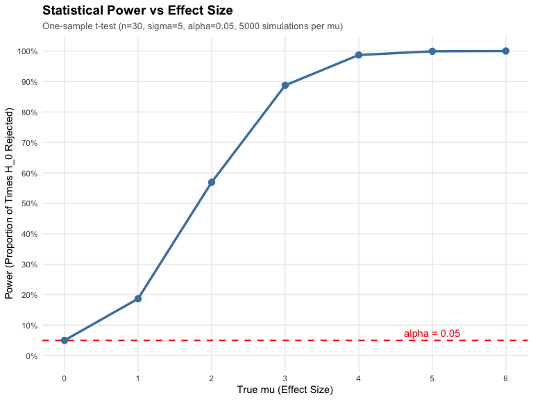
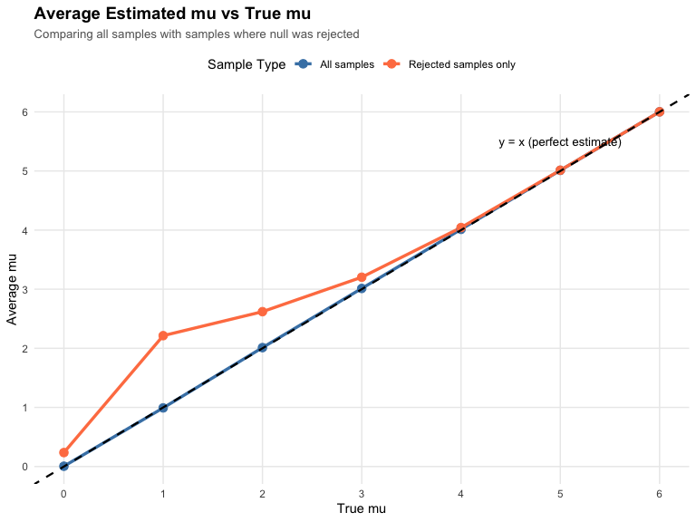
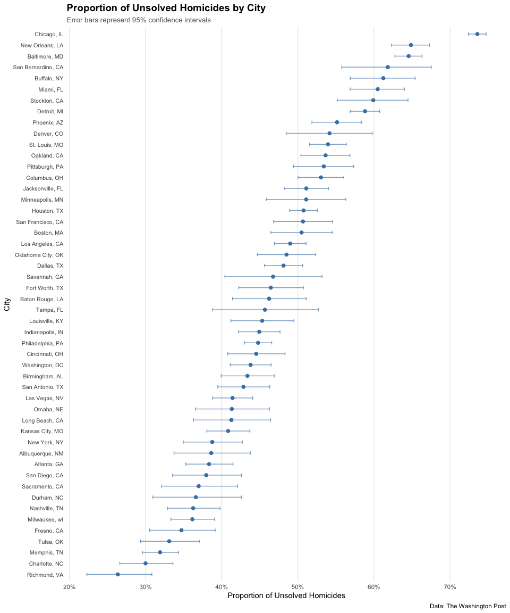
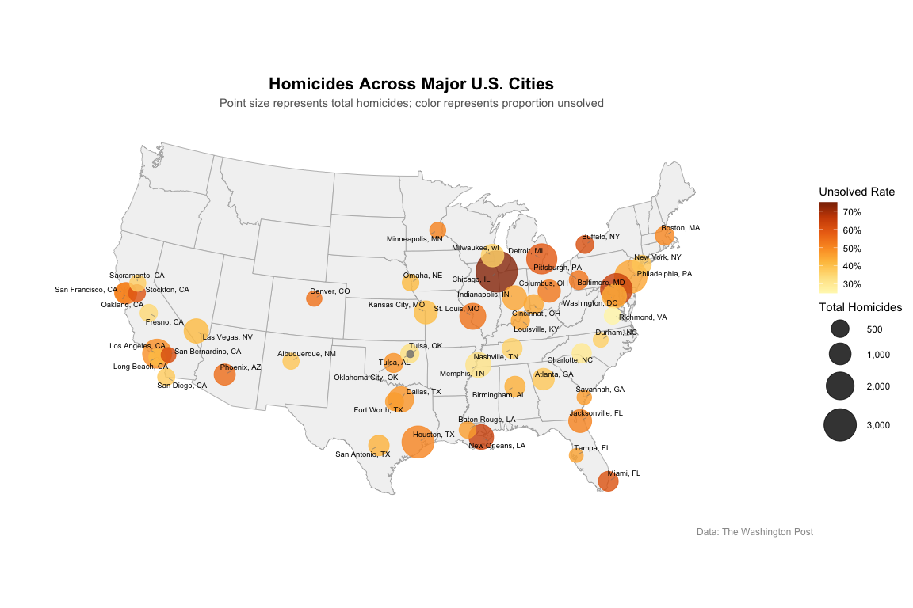

Homework 5 - P8105 Data Science I
================
Yongyan Liu (yl6107)
Oct 30, 2025

- [Problem 1: Birthday Paradox
  Simulation](#problem-1-birthday-paradox-simulation)
  - [Run simulations](#run-simulations)
  - [Visualization](#visualization)
  - [Comments](#comments)
- [Problem 2: Power Analysis
  Simulation](#problem-2-power-analysis-simulation)
  - [Run simulations for different sample mean $\mu$
    values](#run-simulations-for-different-sample-mean-mu-values)
  - [Power analysis](#power-analysis)
  - [Visualization 1: Power vs True
    $\mu$](#visualization-1-power-vs-true-mu)
  - [Visualization 2: Average $\mu$ vs True
    $\mu$](#visualization-2-average-mu-vs-true-mu)
  - [Interpretation](#interpretation)
- [Problem 3: Washington Post Homicides
  Analysis](#problem-3-washington-post-homicides-analysis)
  - [Load and describe the data](#load-and-describe-the-data)
  - [Create city_state variable and summarize
    data](#create-city_state-variable-and-summarize-data)
  - [Proportion test for Baltimore,
    MD](#proportion-test-for-baltimore-md)
  - [Visualization: Proportion of unsolved homicides by
    city](#visualization-proportion-of-unsolved-homicides-by-city)
  - [Geographic map visualization (just for
    fun)](#geographic-map-visualization-just-for-fun)

## Problem 1: Birthday Paradox Simulation

### Run simulations

Create a function that randomly assigns birthdays to n people and checks
for duplicates:

``` r
birthday_simulation = function(n) {
  # Randomly assign birthdays to n people (1-365)
  birthdays = sample(1:365, size = n, replace = TRUE)

  # Check if there are any duplicate birthdays
  has_duplicate = any(duplicated(birthdays))

  return(has_duplicate)
}
```

Run the function 10,000 times for each group size from 2 to 50:

``` r
# Number of simulations per group size
n_simulations = 10000

# Group sizes to test
group_sizes = 2:50

# Run simulations and calculate probabilities
simulation_results = tibble(
    group_size = group_sizes
  ) %>%
  mutate(
    # Run 10,000 simulations for each group size
    probability = purrr::map_dbl(group_size, function(n) {
      # Run the simulation n_simulations times
      results = replicate(n_simulations, birthday_simulation(n))
      # Calculate probability as proportion of TRUE results
      mean(results)
    }),

    # Calculate theoretical probability using the birthday paradox formula
    theoretical_prob = purrr::map_dbl(group_size, function(n) {
      if (n > 365) return(1)

      # P(at least one match) = 1 - P(no matches)
      prob_no_match = prod((365:(365-n+1))/365)
      1 - prob_no_match
    })
  )
```

### Visualization

Create a plot showing the probability of shared birthdays vs. group
size:

``` r
ggplot(simulation_results, aes(x = group_size)) +
  geom_line(aes(y = theoretical_prob, color = "Theoretical"), linewidth = 2) +
  geom_line(aes(y = probability, color = "Simulation"), linewidth = 1) +
  geom_point(aes(y = probability, color = "Simulation"), size = 2, alpha = 0.6) +
  geom_hline(yintercept = 0.5, linetype = "dashed", color = "gray50", linewidth = 0.5) +
  geom_vline(xintercept = 23, linetype = "dashed", color = "gray50", linewidth = 0.5) +
  annotate("text", x = 30, y = 0.5, label = "50% probability",
           vjust = -0.5, color = "gray30") +
  annotate("text", x = 23, y = 0.9, label = "n = 23",
           hjust = -0.2, color = "gray30") +
  scale_color_manual(
    name = "Method",
    values = c("Simulation" = "steelblue", "Theoretical" = "yellow")
  ) +
  scale_y_continuous(labels = scales::percent_format(),
                     breaks = seq(0, 1, 0.1)) +
  scale_x_continuous(breaks = seq(0, 50, 5)) +
  labs(
    title = "Birthday Paradox: Probability of Shared Birthdays",
    subtitle = "Comparing simulation results with theoretical probability",
    x = "Group Size (Number of People)",
    y = "Probability of At Least Two Shared Birthdays"
  ) +
  theme_minimal() +
  theme(
    plot.title = element_text(face = "bold", size = 14),
    plot.subtitle = element_text(size = 10, color = "gray40"),
    panel.grid.minor = element_blank(),
    legend.position = "top"
  )
```

<!-- -->

### Comments

The birthday paradox demonstrates a counterintuitive probability
phenomenon. Key findings from the simulation:

1.  **Simulation validates theory**: The simulation results (blue line)
    closely match the theoretical probability (yellow line) calculated
    using the formula P(match) = 1 - (365/365) × (364/365) × … ×
    ((365-n+1)/365). This confirms that our simulation is working
    correctly and that 10,000 iterations provide a reliable estimate.

2.  **Rapid probability increase**: The probability of finding at least
    two people with the same birthday increases surprisingly quickly as
    group size grows. With just 23 people, the probability exceeds 50%.

3.  **The “paradox”**: Most people intuitively expect a much larger
    group would be needed to reach 50% probability. Since there are 365
    possible birthdays, one might initially think you’d need 100+ people
    for a 50% chance. However, only 23 people are needed.

4.  **Near certainty with small groups**: By the time we reach 50
    people, the probability is approximately 97.2%.

## Problem 2: Power Analysis Simulation

### Run simulations for different sample mean $\mu$ values

Create a function to simulate datasets and perform t-tests:

``` r
# Function to simulate one dataset and run t-test
sim_t_test = function(n = 30, mu = 0, sigma = 5) {
  # Generate dataset from normal distribution
  data = rnorm(n, mean = mu, sd = sigma)

  # Perform one-sample t-test (H0: mu = 0)
  test_result = t.test(data, mu = 0) %>%
    broom::tidy()
  
  # Extract estimate and p-value
  tibble(
    mu_hat = test_result$estimate,
    p_value = test_result$p.value
  )
}
```

Repeat for $\mu$ in {0, 1, 2, …, 6}:

``` r
# Run 5000 simulations for each $\mu$ value
sim_results_all =
  tibble(true_mu = 0:6) %>%
  mutate(
    sim_data = purrr::map(true_mu, function(mu) {
      tibble(iteration = 1:5000) %>%
        mutate(
          results = purrr::map(iteration, ~sim_t_test(n = 30, mu = mu, sigma = 5))
        ) %>%
        unnest(results)
    })
  ) %>%
  unnest(sim_data)
```

### Power analysis

Calculate power (proportion of times null was rejected) for each true
mu:

``` r
power_results =
  sim_results_all %>%
  mutate(rejected = p_value < 0.05) %>%
  group_by(true_mu) %>%
  summarize(
    power = mean(rejected),
    avg_mu_hat = mean(mu_hat),
    avg_mu_hat_rejected = mean(mu_hat[rejected])
  )

# Display results in a formatted table
power_results %>%
  mutate(
    power = round(power, 4),
    avg_mu_hat = round(avg_mu_hat, 4),
    avg_mu_hat_rejected = round(avg_mu_hat_rejected, 4)
  ) %>%
  knitr::kable(
    col.names = c("True mu", "Power", "Average mu", "Average mu (rejected)"),
    caption = "Power Analysis Results: Effect of True μ on Power and Mean Estimates"
  )
```

| True mu |  Power | Average mu | Average mu (rejected) |
|--------:|-------:|-----------:|----------------------:|
|       0 | 0.0500 |     0.0050 |                0.2359 |
|       1 | 0.1868 |     0.9919 |                2.2141 |
|       2 | 0.5690 |     2.0117 |                2.6200 |
|       3 | 0.8874 |     3.0129 |                3.2030 |
|       4 | 0.9870 |     4.0130 |                4.0433 |
|       5 | 0.9992 |     5.0107 |                5.0132 |
|       6 | 1.0000 |     6.0014 |                6.0014 |

Power Analysis Results: Effect of True μ on Power and Mean Estimates

### Visualization 1: Power vs True $\mu$

Plot showing the proportion of times the null was rejected:

``` r
ggplot(power_results, aes(x = true_mu, y = power)) +
  geom_line(color = "steelblue", linewidth = 1.2) +
  geom_point(color = "steelblue", size = 3) +
  geom_hline(yintercept = 0.05, linetype = "dashed", color = "red", linewidth = 0.8) +
  annotate("text", x = 5, y = 0.05, label = "alpha = 0.05",
           vjust = -0.5, color = "red") +
  scale_y_continuous(labels = scales::percent_format(),
                     breaks = seq(0, 1, 0.1),
                     limits = c(0, 1)) +
  scale_x_continuous(breaks = 0:6) +
  labs(
    title = "Statistical Power vs Effect Size",
    subtitle = "One-sample t-test (n=30, sigma=5, alpha=0.05, 5000 simulations per mu)",
    x = "True mu (Effect Size)",
    y = "Power (Proportion of Times H_0 Rejected)"
  ) +
  theme_minimal() +
  theme(
    plot.title = element_text(face = "bold", size = 14),
    plot.subtitle = element_text(size = 10, color = "gray40"),
    panel.grid.minor = element_blank()
  )
```

<!-- -->

### Visualization 2: Average $\mu$ vs True $\mu$

Plot comparing average estimate across all samples vs only rejected
samples:

``` r
# Prepare data for plotting
plot_data = power_results %>%
  select(true_mu, avg_mu_hat, avg_mu_hat_rejected) %>%
  pivot_longer(
    cols = c(avg_mu_hat, avg_mu_hat_rejected),
    names_to = "sample_type",
    values_to = "average_estimate"
  ) %>%
  mutate(
    sample_type = recode(sample_type,
                        "avg_mu_hat" = "All samples",
                        "avg_mu_hat_rejected" = "Rejected samples only")
  )

ggplot(plot_data, aes(x = true_mu, y = average_estimate, color = sample_type)) +
  geom_line(linewidth = 1.2) +
  geom_point(size = 3) +
  geom_abline(intercept = 0, slope = 1, linetype = "dashed",
              color = "black", linewidth = 0.8) +
  annotate("text", x = 5, y = 5.5, label = "y = x (perfect estimate)",
           color = "black", size = 3.5) +
  scale_color_manual(
    name = "Sample Type",
    values = c("All samples" = "steelblue", "Rejected samples only" = "coral")
  ) +
  scale_x_continuous(breaks = 0:6) +
  scale_y_continuous(breaks = 0:6) +
  labs(
    title = "Average Estimated mu vs True mu",
    subtitle = "Comparing all samples with samples where null was rejected",
    x = "True mu",
    y = "Average mu"
  ) +
  theme_minimal() +
  theme(
    plot.title = element_text(face = "bold", size = 14),
    plot.subtitle = element_text(size = 10, color = "gray40"),
    panel.grid.minor = element_blank(),
    legend.position = "top"
  )
```

<!-- -->

### Interpretation

**Effect size and power:**

The power plot demonstrates the fundamental relationship between effect
size and statistical power:

1.  **At $\mu$ = 0** (null hypothesis true): Power equals $\alpha$ ≈
    0.05, which is expected - this is the Type I error rate.

2.  **Increasing power with effect size**: As the true $\mu$ increases
    from 0 to 6, power increases dramatically. By $\mu$ = 4, power
    exceeds 0.95, and by $\mu$ = 6, power approaches 1.0 (nearly 100%).

3.  **Practical implication**: Larger effect sizes are easier to detect.
    With our sample size (n=30) and variability ($\sigma$=5), moderate
    effects (mu ≥ 3) can be detected with high reliability.

**Average $\mu$ comparisons:**

1.  **All samples (blue line)**: The average $\mu$ across all samples
    closely follows the y = x line, indicating that our estimator is
    unbiased - on average, we correctly estimate the true $\mu$
    regardless of its value.

2.  **Rejected samples only (coral line)**:

    - When $\mu$ = 0, the average $\mu$ for rejected samples is
      noticeably higher than 0. This makes sense: when the null is true,
      rejections only occur due to random chance producing extreme
      values.
    - For small effect sizes ($\mu$ = 1, 2), the rejected-sample average
      still exceeds the true mu, showing **selection bias**: we’re more
      likely to reject when random sampling gives us unusually large
      sample means.
    - As $\mu$ increases ($\mu$ ≥ 4), the rejected-sample averages
      converge toward the true values because power is so high that
      nearly all samples lead to rejection, eliminating selection bias.

3.  **Why rejected-sample means don’t equal true $\mu$ for small
    effects**: When power is low, the samples that lead to rejection
    tend to be those with sample means inflated by sampling variability.
    Only samples with higher sample mean cross the significance
    threshold, creating upward bias in the average sample means among
    successful rejections.

## Problem 3: Washington Post Homicides Analysis

### Load and describe the data

Load the homicide data from the Washington Post GitHub repository:

``` r
# Load homicide data
homicide_data = read_csv("https://raw.githubusercontent.com/washingtonpost/data-homicides/master/homicide-data.csv", show_col_types = FALSE)
```

**Data description:**

The raw dataset contains 52179 observations and 12 variables. Each row
represents a single homicide case in one of 50 major U.S. cities. Key
variables include:

- `uid`: Unique identifier for each case
- `reported_date`: Date the homicide was reported
- `victim_last`, `victim_first`: Victim’s name
- `victim_race`, `victim_age`, `victim_sex`: Victim demographics
- `city`, `state`: Location of the homicide
- `lat`, `lon`: Geographic coordinates
- `disposition`: Case status (e.g., “Closed without arrest”, “Closed by
  arrest”, “Open/No arrest”)

### Create city_state variable and summarize data

Create a `city_state` variable and summarize homicides by city:

``` r
# Create city_state variable and summarize
homicide_summary = homicide_data %>%
  mutate(city_state = str_c(city, ", ", state)) %>%
  group_by(city_state) %>%
  summarize(
    total_homicides = n(),
    unsolved_homicides = sum(disposition %in% c("Closed without arrest", "Open/No arrest"))
  ) %>%
  arrange(desc(total_homicides))

# Display summary - Top 10 cities by total homicides
homicide_summary %>%
  mutate(unsolved_rate = unsolved_homicides / total_homicides) %>%
  head(10) %>%
  mutate(rank = row_number()) %>%
  select(rank, everything()) %>%
  knitr::kable(
    col.names = c("Rank", "City, State", "Total Homicides", "Unsolved Homicides", "Unsolved Rate"),
    caption = "Top 10 Cities by Total Homicides",
    digits = c(0, 0, 0, 0, 3)
  )
```

| Rank | City, State      | Total Homicides | Unsolved Homicides | Unsolved Rate |
|-----:|:-----------------|----------------:|-------------------:|--------------:|
|    1 | Chicago, IL      |            5535 |               4073 |         0.736 |
|    2 | Philadelphia, PA |            3037 |               1360 |         0.448 |
|    3 | Houston, TX      |            2942 |               1493 |         0.507 |
|    4 | Baltimore, MD    |            2827 |               1825 |         0.646 |
|    5 | Detroit, MI      |            2519 |               1482 |         0.588 |
|    6 | Los Angeles, CA  |            2257 |               1106 |         0.490 |
|    7 | St. Louis, MO    |            1677 |                905 |         0.540 |
|    8 | Dallas, TX       |            1567 |                754 |         0.481 |
|    9 | Memphis, TN      |            1514 |                483 |         0.319 |
|   10 | New Orleans, LA  |            1434 |                930 |         0.649 |

Top 10 Cities by Total Homicides

``` r
# Display cities with highest unsolved rates
homicide_summary %>%
  mutate(unsolved_rate = unsolved_homicides / total_homicides) %>%
  arrange(desc(unsolved_rate)) %>%
  head(10) %>%
  mutate(rank = row_number()) %>%
  select(rank, everything()) %>%
  knitr::kable(
    col.names = c("Rank", "City, State", "Total Homicides", "Unsolved Homicides", "Unsolved Rate"),
    caption = "Top 10 Cities by Unsolved Rate",
    digits = c(0, 0, 0, 0, 3)
  )
```

| Rank | City, State        | Total Homicides | Unsolved Homicides | Unsolved Rate |
|-----:|:-------------------|----------------:|-------------------:|--------------:|
|    1 | Chicago, IL        |            5535 |               4073 |         0.736 |
|    2 | New Orleans, LA    |            1434 |                930 |         0.649 |
|    3 | Baltimore, MD      |            2827 |               1825 |         0.646 |
|    4 | San Bernardino, CA |             275 |                170 |         0.618 |
|    5 | Buffalo, NY        |             521 |                319 |         0.612 |
|    6 | Miami, FL          |             744 |                450 |         0.605 |
|    7 | Stockton, CA       |             444 |                266 |         0.599 |
|    8 | Detroit, MI        |            2519 |               1482 |         0.588 |
|    9 | Phoenix, AZ        |             914 |                504 |         0.551 |
|   10 | Denver, CO         |             312 |                169 |         0.542 |

Top 10 Cities by Unsolved Rate

### Proportion test for Baltimore, MD

Estimate the proportion of unsolved homicides in Baltimore, MD:

``` r
# Extract Baltimore data
baltimore_data = homicide_summary %>%
  filter(city_state == "Baltimore, MD")

# Run proportion test
baltimore_test = prop.test(
  x = baltimore_data$unsolved_homicides,
  n = baltimore_data$total_homicides
) %>%
  broom::tidy()

# Display results
baltimore_test %>%
  select(estimate, conf.low, conf.high) %>%
  knitr::kable(
    col.names = c("Estimated Proportion", "95% CI Lower", "95% CI Upper"),
    caption = "Proportion of Unsolved Homicides in Baltimore, MD",
    digits = 3
  )
```

| Estimated Proportion | 95% CI Lower | 95% CI Upper |
|---------------------:|-------------:|-------------:|
|                0.646 |        0.628 |        0.663 |

Proportion of Unsolved Homicides in Baltimore, MD

The estimated proportion of unsolved homicides in Baltimore, MD is 0.646
with a 95% confidence interval of (0.628, 0.663).

### Visualization: Proportion of unsolved homicides by city

Run `prop.test` for each city using a tidy pipeline:

``` r
# Run prop.test for all cities
city_prop_tests = homicide_summary %>%
  # the CI makes no sense if n is too small
  filter(total_homicides >= 5) %>%
  mutate(
    prop_test_result = purrr::map2(unsolved_homicides, total_homicides,
                                   ~prop.test(x = .x, n = .y, correct = TRUE) %>% broom::tidy())
  ) %>%
  unnest(prop_test_result) %>%
  select(city_state, estimate, conf.low, conf.high)
```

Create a plot showing estimates and confidence intervals for each city:

``` r
# Create plot ordered by proportion of unsolved homicides
city_prop_tests %>%
  mutate(city_state = fct_reorder(city_state, estimate)) %>%
  ggplot(aes(x = city_state, y = estimate)) +
  geom_point(color = "steelblue", size = 2) +
  geom_errorbar(aes(ymin = conf.low, ymax = conf.high),
                width = 0.3, color = "steelblue", alpha = 0.7) +
  coord_flip() +
  scale_y_continuous(labels = scales::percent_format(),
                     breaks = seq(0, 1, 0.1)) +
  labs(
    title = "Proportion of Unsolved Homicides by City",
    subtitle = "Error bars represent 95% confidence intervals",
    x = "City",
    y = "Proportion of Unsolved Homicides",
    caption = "Data: The Washington Post"
  ) +
  theme_minimal() +
  theme(
    plot.title = element_text(face = "bold", size = 14),
    plot.subtitle = element_text(size = 10, color = "gray40"),
    axis.text.y = element_text(size = 8),
    panel.grid.major.y = element_blank(),
    panel.grid.minor = element_blank()
  )
```

<!-- -->

### Geographic map visualization (just for fun)

Create a US map showing homicides by city with size and color encoding:

<!-- -->

**Key observations:**

Unsolved homicide rates vary dramatically (25-75%) across cities.
Chicago, New Orleans, and Baltimore show highest unsolved rates, while
Richmond and Charlotte show lowest. Larger cities tend to have both more
total homicides and higher unsolved rates. Geographic patterns show
variation across all regions without clear coastal-interior
distinctions.
